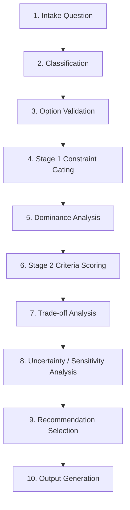

# Decision Pipeline

This document defines the strict sequential pipeline for evaluating options.

Every execution step MUST verify the prerequisites of the previous step. No skipping of steps is allowed.
If any step fails validation, the execution stops and reports a Quality Gate violation.
